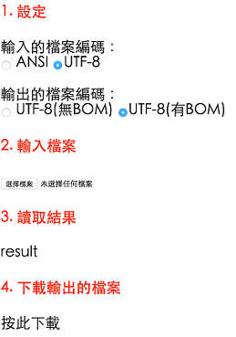

# javascript I/O with ANSI/UTF-8

有些軟體（例如 Microsoft Office ）預設是以 ANSI 開啟與儲存檔案，而有些軟體（例如 Sublime Text）或作業系統（例如 OSX）預設則是 Unicode，不同軟體間不同的編碼方式，造成工程師許多不必要的困擾。

這個簡單的小程式示範如何用 javascript 讀入、輸出 ANSI 與 UTF-8 編碼的檔案。

## Demo

Demo page:

- [http://chunnorris.net/demo/js_io_with_ansi_utf/](http://chunnorris.net/demo/js_io_with_ansi_utf/)

Sample files:

- [csv data with ANSI encoding](http://chunnorris.net/demo/js_io_with_ansi_utf/sample/dataANSI.csv)
- [csv data with UTF-8(w/o BOM) encoding](http://chunnorris.net/demo/js_io_with_ansi_utf/sample/dataUTFnoBOM.csv)
- [csv data with UTF-8(with BOM) encoding](http://chunnorris.net/demo/js_io_with_ansi_utf/sample/dataUTFwithBOM.csv)

## 使用方式 Usage

1. 選取輸入的檔案編碼(ANSI, UTF-8)
2. 選取輸出的檔案編碼(UTF-8 with/without BOM)
3. 選擇輸入的檔案
4. 看看讀取結果是否有正常，或是亂碼
5. 下載輸出的檔案，看看結果是否正常，或是亂碼

## 結論 Conclusion

若欲讀入的檔案為 ANSI 編碼（例如 big5）：

    reader.readAsText(file, ‘big5’);

若欲讀入的檔案為 UTF-8 編碼：

    reader.readAsText(file);

若欲輸出的檔案為 UTF-8 ( 無 BOM )

    不用做任何動作

若欲輸出的檔案為 UTF-8 ( 有 BOM )

    在輸出端開頭加入 '\uFEFF'

註：大部份預設 ANSI 模式的軟體，看到 UTF-8 的 BOM 後，都能正確的以 UTF-8 開啟，故輸出含 BOM 的 UTF-8 即可達成我們的目的。

## Reference

- [Get/set file encoding with javascript's FileReader](https://stackoverflow.com/questions/12448595/get-set-file-encoding-with-javascripts-filereader)
- [It is not possible to save a file in another encoding than UTF8](https://github.com/eligrey/FileSaver.js/issues/25)
- [Saving CSV with unique chars using in a different encoding other than UTF-8](https://github.com/eligrey/FileSaver.js/issues/28)
- [How can I save a csv with utf-8 encoding using Excel 2013?](https://answers.microsoft.com/en-us/office/forum/office_2013_release-excel/how-can-i-save-a-csv-with-utf-8-encoding-using/12801501-c1e4-4a64-80d9-96b680b64cfe)
- [How to create UTF-8 CSV file from an Excel spreadsheet containing Asian Characters?](https://help.salesforce.com/apex/HTViewSolution?id=000003837&language=en_US)

## License

[MIT license](http://opensource.org/licenses/MIT).

built with [jQuery](https://jquery.com/)
